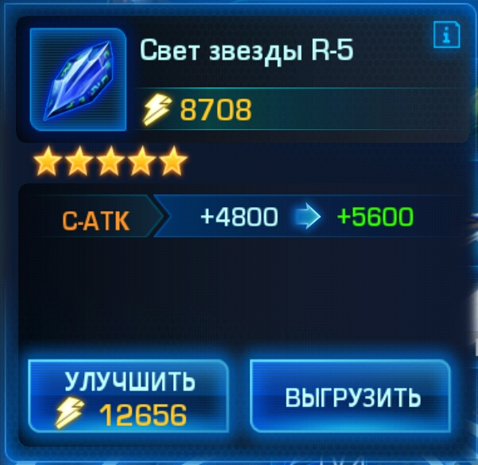
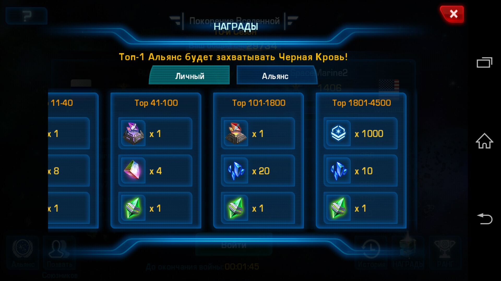
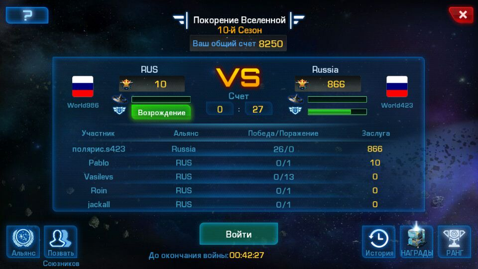
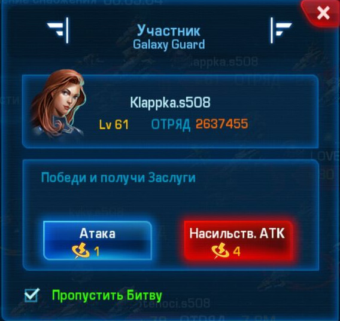
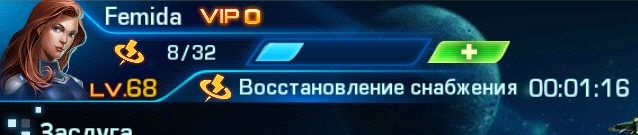

# Clan wars

*Sorry for my rough translation. I try as best I can.*

## What is war

War is a battle of all clans, of all servers worldwide. Each clan, alone
fighting with another clan. Involved the entire clan. One player can
dramatically affect the outcome of the battle. Therefore, if possible, not to
shirk. The war itself will last 3 days, as well as Pandora. So it will be a
severe marathon. I took part in all battles and i know what i'm saying.

## Rules

### Follow the schedule!

This is the most important. The war started after the update server, ie at
00:00 server time.

After the upgrade, the server starts the first battle, and every 4 hours,
repeated battle. Ie schedule server time:

* 00:00;
* 04:00;
* 08:00;
* 12:00;
* 16:00;
* 20:00.

Next, I will describe why a schedule. You need to enter the game for 5-10
minutes before the scheduled time and wait for instructions in the game chat.

The last battle will take place on Monday at 22:30, because the developers
close access for 1 hour before end the event.

### No one declares war.

No one declares war. Declare war can only head of the clan:
ghost404, Koshak, Ber. For a declaration of war, will be very painful beat.

*<Here is a picture. What button to press is impossible>*

## Reward

In case of successful participation in the war each clan member will receive 3
random stone R5 on the similarity of this:

### 1nd stone for clan merit.

Considered to be the total number of points scored clan as a result of
victories and, depending on the ranking obtain stone. The more players
fighting, more wins, the higher in the rankings.

### 2nd stone for personal merit.

Similarly, however, are considered to be points scored personally you.

### 3nd stone is given for 100 uninterrupted victories.

Considered only victory. One defeat and the count is reset and set starts at 0.

*<Here is a picture of the current account wins>*

Independently perform this task difficult. This requires teamwork. So be sure
to read the next section. At the end of the war, we get a lot of buns.

## Battle

The battle itself is as follows. Upon entering you will see the current battle
and his account.

In the screenshot we have 0 wins and 10 points, the enemy has 27 wins and 866
points *(is an example of what happens if not declare war on schedule)*.
Considered a victory on points, not wins. You press the **Enter** button and you
see the enemy base, next to her enemy defender and a few players on the right
and the left. By the time you have to enter, the base and the defender will be
destroyed.

Enemy players you will see, but you will not see their level and size of the
fleet until you attack them.

Our activists *(ghost404, Koshak, Ber, Kolok)*, and scouts will be notified in
game chat information on enemy ships. Example of a message in the chat:

* Koshak 80 11,6 - *nick Koshak, level 80, fleet 11,6M*
* Kolok 82 18,3 - *nick Kolok, level 82, fleet 18,3M*

Choose your opponent so that he was not weaker than you 5 levels, then you will
be given 40 points or they will be less. If you can not beat any opponent, you
can use the violent attack * (4 equipment) *, that would not interrupt the
series of 100 wins and get 40 points.

Or, you can attack the fortress. Fortress give 10 points and a series of 100
victories is not broken, but does not increase.

**Be careful. Violent attack has no effect on the fleet defender!**

## Equipment

Equipment, the number of attacks that you can perform. Equipment is fully
restored 4 hours, so attack it every 4 hours.

If you declare war on their own, not on schedule, then the other players will
not be equipment and they can not participate in the war, we will lose the
battle, dropping in the rankings and we'll have less chance of getting a reward
for winning clan. Therefore, we go to war **only** on schedule, and **only** on
the team.

## Tricks

There is one trick that we unfortunately can not normally check. The essence
of the trick lies in the fact that all members of the clan before the
declaration of war dismiss the entire fleet and removed equipment from the
flagship. Respectively, after the declaration of war all return everything in
place.

The essence of the trick lies in the fact that at the time of the declaration
of war our clan is weak and there is a possibility that the selection of the
enemy, he will be picked up according to our current level, ie the enemy is
weak.

In general, we go into the portal and dissolve all the ships. Do not worry,
equipment and stones at them saved. Next, go into the **Fleet** and click the
button **Click for unloading**. After the declaration of war repeat the
operation in the reverse order.

