# Война кланов

## Что такое война

Война это сражение всех кланов, по всем серверам, во всем мире. Каждый клан в,
отдельности сражается с другим кланом. Участвует весь клан. Один игрок может
кардинально повлиять на исход битвы. Поэтому, по возможности, не прогуливать.
Сама война продлится 3 дня, как и Пандора. Так что это будет суровый марафон.
Я сам участвовал во всех сражениях и знаю что говорю.

## Правила

### Следуем расписанию!

Это самое важное. Война начинается после обновления сервера, тоесть в 00:00 по
серверному времени.

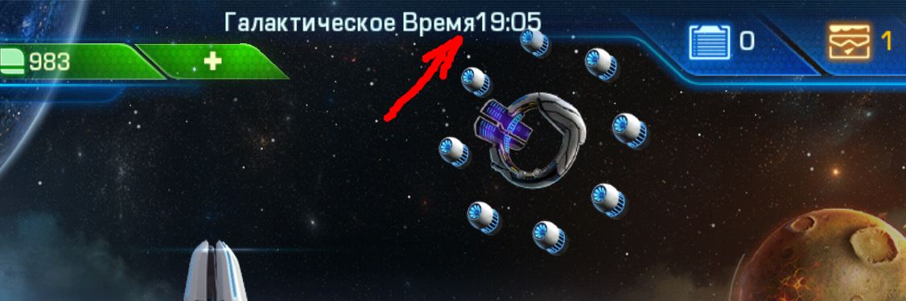

После обновления сервера начинается первая битва и через каждые 4 часа, битвы
повторяются. Тоесть расписание по серверному времени:

* Суббота: 00:00, 04:00, 08:00, 12:00, 16:00, 20:00;
* Воскресенье: 00:00, 04:00, 08:00, 12:00, 16:00, 20:00;
* Понедельник: 00:00, 04:00, 08:00, 12:00, 16:00, 20:00, 22:30.

Далее, опишу почему именно такое расписание. Тебе нужно зайти в игру за 5-10
минут до времени указанного в расписании и ждем инструкций в чате игры и
WhatsApp.

Последнее сражение, в понедельник пройдет в 22:30, потому что разработчики
закрывают доступ за 1 час до окончания акции.

### Никто не объявляет войну.

**Никто** не объявляет войну. Объявлять войну могут только главы клана:
ghost404, Koshak, Ber. За объявление войны будут бить по наглой рыжей морде.

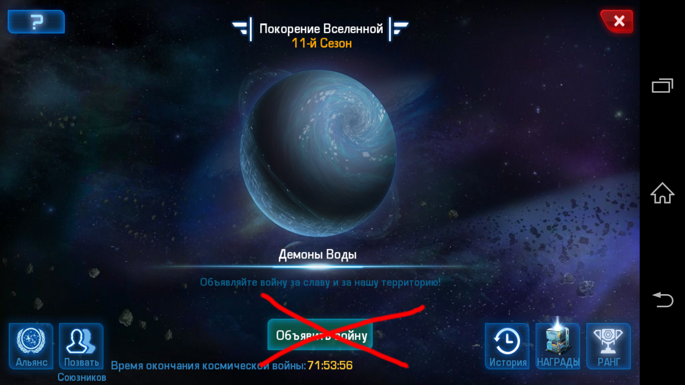

## Награда

В случае успешного участия в войне каждый участник клана получит 3 случайных
камня R5 на подобии этого:

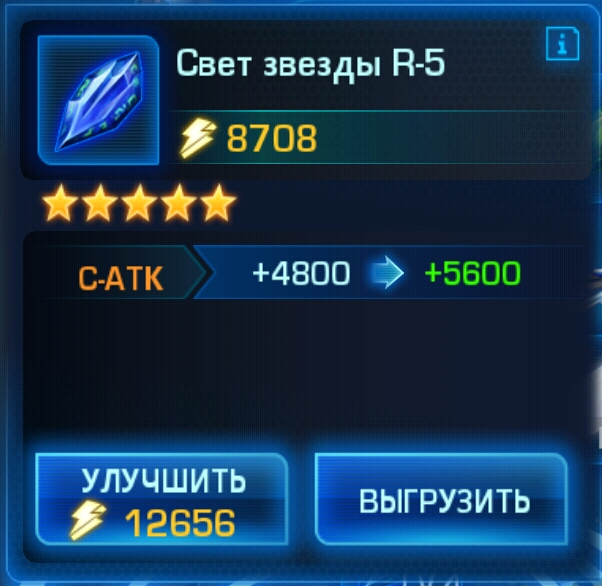

### 1-ый камень за заслуги клана.

Считается общее число очков набранных кланом в результате побед и в зависимости
от места в рейтинге получаем камень. Чем больше игроков воюют, чем больше побед,
тем выше в рейтинге.

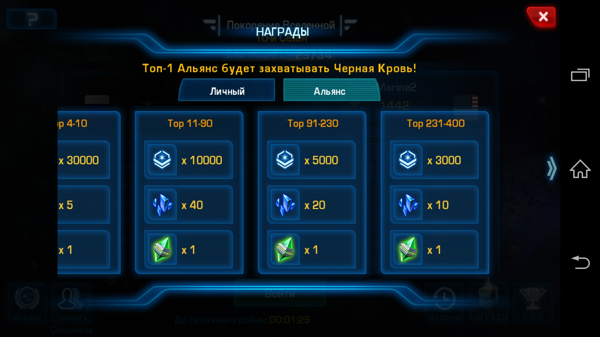

### 2-й камень за личные заслуги.

Аналогично, только считаются очки набранные лично тобой.

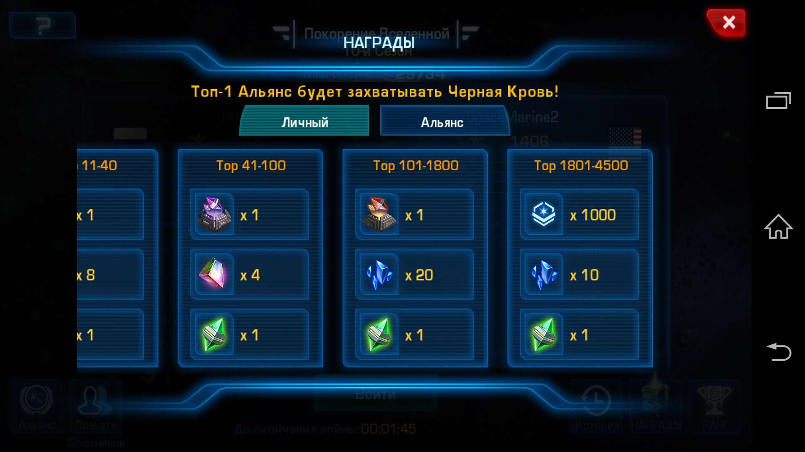

### 3-й камень дают за 100 беспрерывных побед.

Считаются только победы. Одно поражение и счет сбрасывается и набор начинается
с 0.

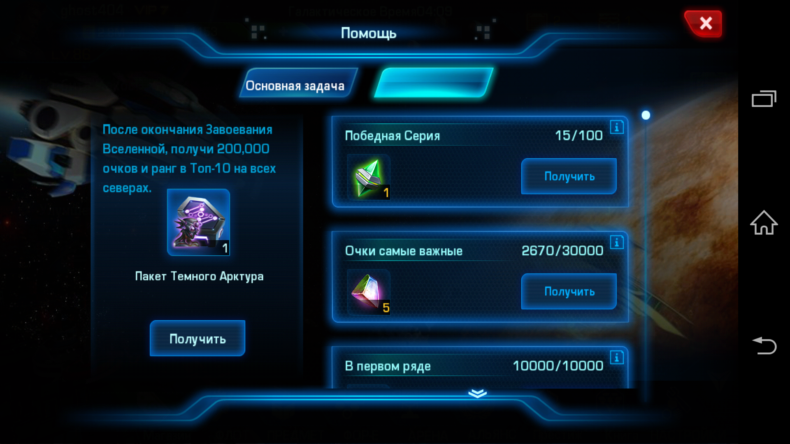

Самостоятельно выполнить это задание сложно. Для этого нужна командная работа.
Поэтому обязательно читаем следующий раздел. По окончанию войны мы получим
много плюшек.

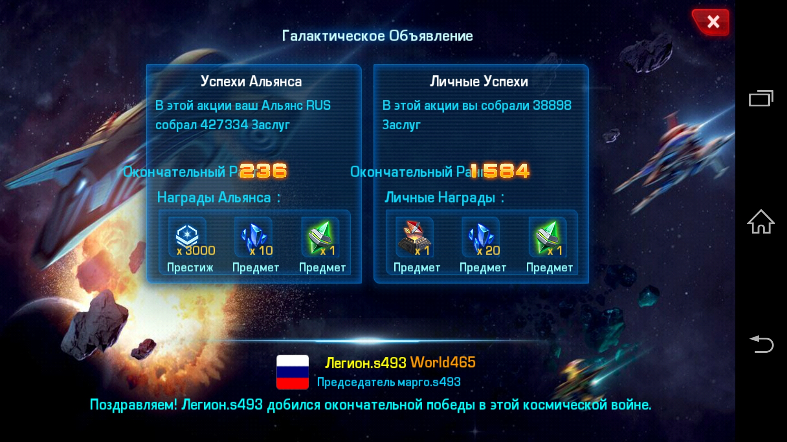

## Сражение

Само сражение выглядит следующим образом. При входе ты увидишь текущее сражение
и его счет.

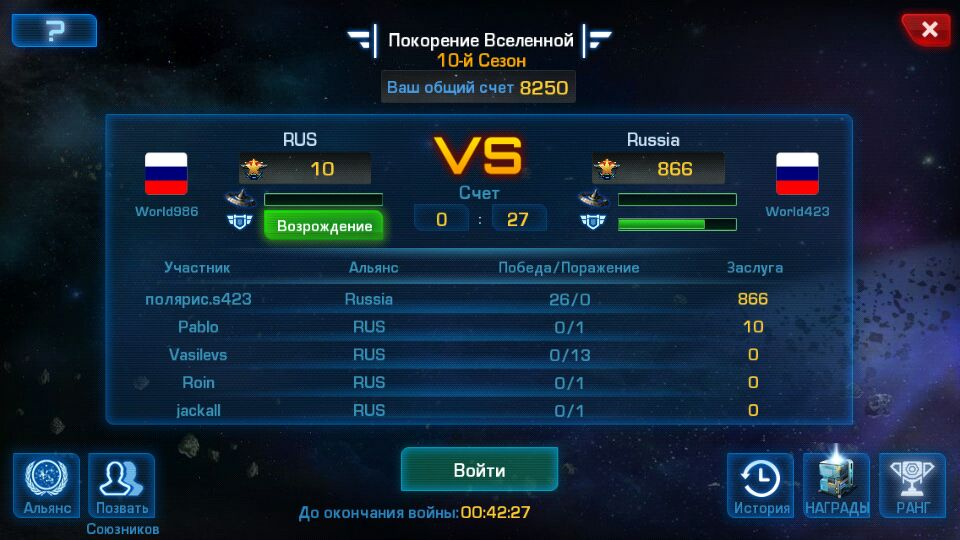

На скриншоте у нас 0 побед и 10 очков, у врага 27 побед и 866 очков
*(это пример того что бывает если объявить войну не по расписанию)*. Победа
считается по очкам, не по победам. Нажимаешь кнопку **Войти** и видишь базу
противника, рядом с ней вражеского защитника и несколько игроков с права и с
лева. К тому времени когда ты должен войти, база и защитник буду уничтожены.

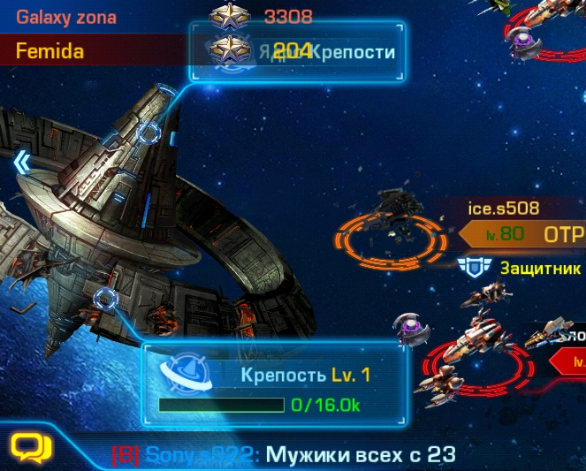

Вражеских игроков ты будешь видеть, но не будешь видеть их уровень и размер
флота пока не нападешь на них.

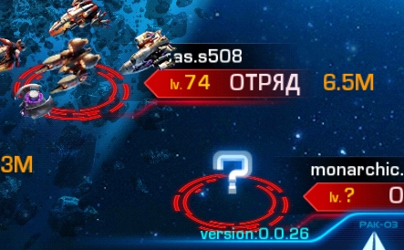

Наши активисты *(ghost404, Koshak, Ber, Kolok)*, будут разведчиками и
сообщат в чате игры и WhatsApp информацию о кораблях противника. Пример
сообщения в чате:

* Koshak 80 11,6 - *ник Koshak, уровень 80 левел, флот 11,6М*
* Kolok 82 18,3 - *ник Kolok, уровень 82 левел, флот 18,3М*

Гораздо удобней смотреть все на скриншоте в WhatsApp. Для того что бы добавится
в WhatsApp необходимо сообщить Femida номер телефона. Она администратор группы
в WhatsApp. *У Femida сломался телефон, но все равно пишите ей.*

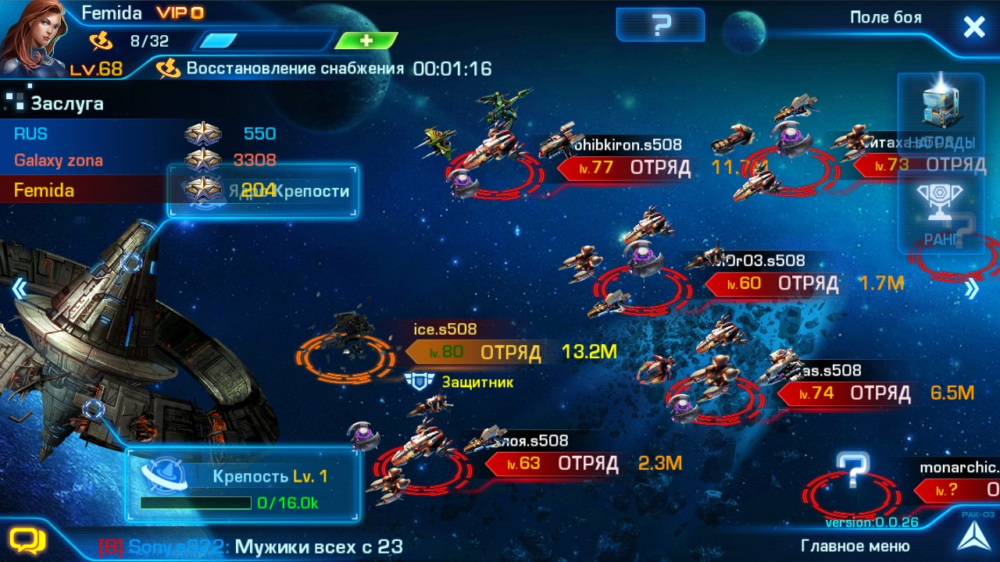

Выбери себе противника так что бы он был не слабее тебя на 5 уровней, тогда
тебе дадут 40 очков иначе их будет меньше. Если ты не можете одолеть ни одного
противника, то ты можете использовать насильственную атаку *(4 снаряжения)*, что
бы не прерывать серию из 100 побед и получить 40 очков.

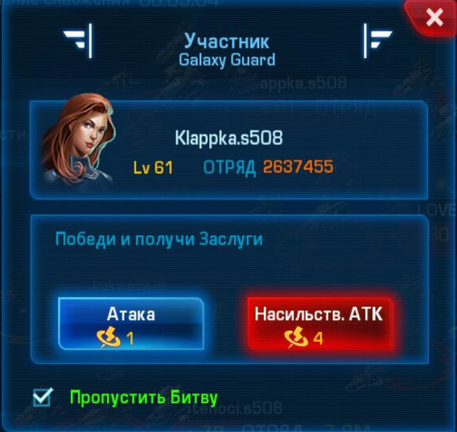

Или можно атаковать крепость. За крепость дают 10 очков и серия из 100 побед не
нарушается, но и не увеличивается.

**Будь внимателен. Насильственные атаки не действуют на защитников!**

## Снаряжение

Снаряжение, это количество атак которые ты можешь выполнить. Снаряжение
полностью восстанавливается 4 часа, поэтому атаки именно каждые 4 часа.

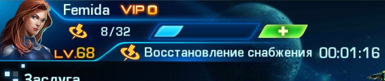

Если ты объявишь войну самостоятельно, не по расписанию, то у остальных игроков
не будет снаряжения и они не смогут участвовать в войне, мы проиграем битву,
понизимся в рейтинге и у нас будет меньше шансов получить награду за победу
клана. Поэтому заходим в войну **только** по расписанию и **только** по
команде.

## Трюки

Есть один трюк, который мы к сожалению не можем нормально проверить. Суть трюка
заключается в том что все участники клана перед объявлением войны распускают
весь флот и снимают оборудование с флагмана. Соответсвенно, после объявления
войны все возвращают все на место.

Суть трюка заключается в том что в момент объявления войны наш клан оказывается
слабым и есть вероятность что при подборе противника, он будет подобран в
соответствии с нашим текушим уровнем, тоесть противник будет слабым.

Вобщем, заходим в портал и **распускаем** все корабли. Не волнуйтесь, оборудование
и камни на них сохранятся. Далее заходим во **Флот** и жмем кнопку **Нажмите для
Выгрузки**. После объявления войны повторяем операцию в обратном порядке.

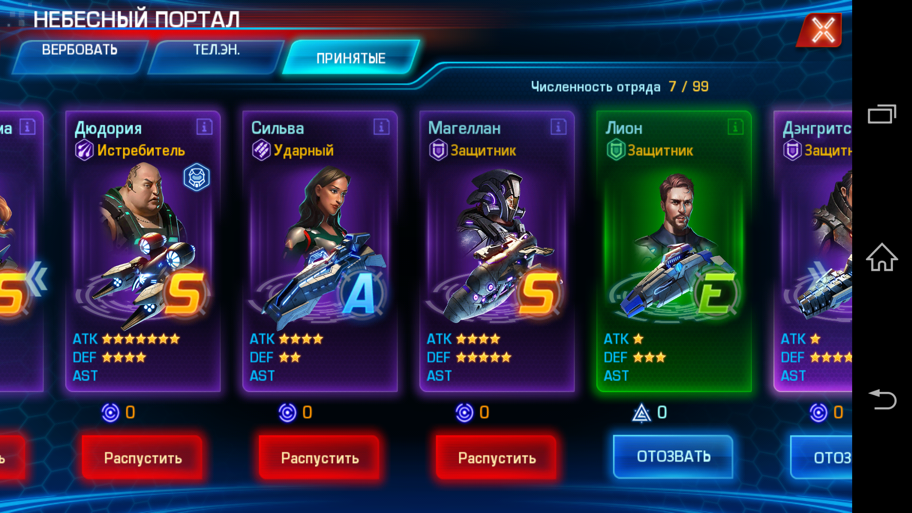
